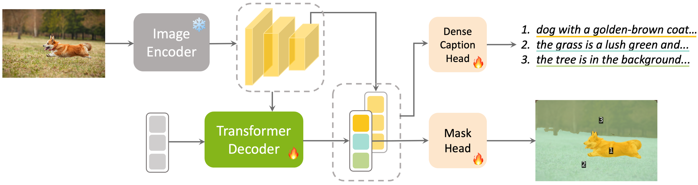

# Pix2Cap-COCO: Advancing Visual Comprehension via Pixel-Level Captioning
<a href='https://arxiv.org/abs/2501.13893'></a>
<a href='https://huggingface.co/datasets/geshang/Pix2Cap-COCO'></a>
## Overview

<p align="center">
  
</p>

## Getting Started

### Environment Setup
* We use CUDA 12.6 for implementation.
* Our code is built upon Pytorch 2.1.1, please check PyTorch version matches CUDA and that is required by Detectron2.
* We train our models on 8 NVIDIA A100 GPUs with 80G memory, please make sure that your VRAM is sufficient to avoid the potential OOM issues during training.


```bash
# create environment
conda create --name pix2cap python=3.8
conda activate pix2cap
pip install -r requirements.txt
conda install -c conda-forge mpi4py

# install detectron2
git clone https://github.com/MaureenZOU/detectron2-xyz.git # under your working directory
cd detectron2-xyz && pip install -e . && cd ..

# install other dependencies
git clone https://github.com/cocodataset/panopticapi.git
cd panopticapi/ && python setup.py build_ext --inplace  && python setup.py build_ext install && cd ..
pip install git+https://github.com/arogozhnikov/einops.git
pip install git+https://github.com/openai/whisper.git

# download nltk related
python utils/download_nltk.py

# compile CUDA kernel for MSDeformAttn
cd modeling/vision/encoder/ops && sh make.sh && cd ../../../../

# install stanford-nlp
bash datasets/evaluation/eval/get_stanford_models.sh
```
---
### Quick Start


We provide an inference demo here if you want to try out the our model. You should download the weights from [here](https://huggingface.co/geshang/Pix2Cap/tree/main) and run the following command:

```
python inference/infer_densecaptioning.py evaluate \
    --conf_files configs/pix2cap_panoptic_segmentation_captioning.yaml \
    --overrides RESUME_FROM path/to/your/weights
```
---
### Prepare Datasets

This guide provides step-by-step instructions to prepare the datasets required for the Pix2Cap.

---

1. Download COCO Caption Data
    ```bash
    mkdir pix2cap_data && cd pix2cap_data
    wget https://huggingface.co/xdecoder/X-Decoder/resolve/main/coco_caption.zip
    unzip coco_caption.zip
    ```
---
2. Download Panoptic COCO 2017 Data
    ```bash
    mkdir coco && cd coco
    wget http://images.cocodataset.org/zips/train2017.zip && unzip train2017.zip
    wget http://images.cocodataset.org/zips/val2017.zip && unzip val2017.zip
    wget http://images.cocodataset.org/annotations/panoptic_annotations_trainval2017.zip && unzip panoptic_annotations_trainval2017.zip
    cd annotations && mv -u panoptic_val2017.zip panoptic_train2017.zip ../ && cd ..
    unzip panoptic_train2017.zip && unzip panoptic_val2017.zip
    ```
---

3. Download Pix2Cap-COCO Annotations
    ```bash
    cd annotations
    wget https://huggingface.co/xdecoder/X-Decoder/resolve/main/caption_class_similarity.pth
    wget https://huggingface.co/datasets/geshang/Pix2Cap-COCO/resolve/main/pix2cap_coco_train.json
    wget https://huggingface.co/datasets/geshang/Pix2Cap-COCO/resolve/main/pix2cap_coco_val.json
    cd ../../../ && python utils/prepare_coco_semantic_annos_from_panoptic_annos.py
    ```
---
After completing the steps, your dataset directory structure should look like this:

```bash
pix2cap_data/
├── coco_caption/
├── coco/
│   ├── train2017/
│   ├── val2017/
│   ├── panoptic_train2017/
│   ├── panoptic_val2017/
│   ├── panoptic_semseg_train2017/
│   ├── panoptic_semseg_val2017/
│   ├── annotations/
│       ├── panoptic_train2017.json
│       ├── panoptic_val2017.json
├── annotations/
    ├── caption_class_similarity.pth
    ├── pix2cap_coco_train.json
    ├── pix2cap_coco_val.json

```
---

### Prepare Pretrained Weights

download pre-trained X-Decoder and GRiT weights by:

```bash
wget https://huggingface.co/xdecoder/X-Decoder/resolve/main/xdecoder_focall_last.pt
wget https://datarelease.blob.core.windows.net/grit/models/grit_b_densecap.pth
```
---

and run the following line to combine these weights together

```bash
python utils/combine_weights.py
```
---

### Training
```bash
export DETECTRON2_DATASETS=$(pwd)/pix2cap_data
export DATASETS=$(pwd)/pix2cap_data
export FI_EFA_FORK_SAFE=1
CUDA_VISIBLE_DEVICES=0,1,2,3,4,5,6,7 mpirun -n 8 python entry.py train \
            --conf_files configs/pix2cap_panoptic_segmentation_captioning.yaml \
            --overrides \
            FP16 True \
            COCO.INPUT.IMAGE_SIZE 1024 \
            SOLVER.MAX_NUM_EPOCHS 25 \
            MODEL.DECODER.HIDDEN_DIM 512 \
            MODEL.ENCODER.CONVS_DIM 512 \
            MODEL.ENCODER.MASK_DIM 512 \
            MODEL.DECODER.DETECTION Fasle \
            MODEL.DECODER.FROZEX True \
            MODEL.DECODER.DENSECAPTION_WEIGHT 0.1 \
            MODEL.DECODER.TOP_DENSECAPTION_LAYERS 9 \
            MODEL.MASK_HEAD_ENABLED True \
            COCO.TEST.BATCH_SIZE_TOTAL 8 \
            COCO.TRAIN.BATCH_SIZE_TOTAL 32 \
            COCO.TRAIN.BATCH_SIZE_PER_GPU 4 \
            SOLVER.LR_MULTIPLIER.lang_encoder 0.1 \
            WEIGHT True \
            WANDB True \
            RESUME_FROM xdecoder_focall_last_updated.pt
```
---

### Evaluation

  ```bash
  export DETECTRON2_DATASETS=$(pwd)/pix2cap_data
  export DATASETS=$(pwd)/pix2cap_data
  CUDA_VISIBLE_DEVICES=0,1 mpirun -n 2 python entry.py evaluate \
              --conf_files configs/pix2cap_panoptic_segmentation_captioning.yaml \
              --overrides \
              COCO.INPUT.IMAGE_SIZE 1024 \
              COCO.TEST.BATCH_SIZE_TOTAL 8 \
              COCO.TRAIN.BATCH_SIZE_TOTAL 4 \
              COCO.TRAIN.BATCH_SIZE_PER_GPU 2 \
              MODEL.DECODER.HIDDEN_DIM 512 \
              MODEL.ENCODER.CONVS_DIM 512 \
              MODEL.ENCODER.MASK_DIM 512 \
              FP16 True \
              WEIGHT True \
              RESUME_FROM path/to/your/weights
  ```

## **Supervised Fine-Tuning (SFT) LMMs with Pix2Cap-COCO**
To fine-tune GPT4RoI with Pix2Cap-COCO:
1. Set up the environment by referring to the [GPT4RoI setup guide](./third_party/gpt4roi/README.md).
2. Run the following command to fine-tune the model (Stage 2) using existing Stage 1 weights:
   ```bash
   bash train_stage2.sh exp/stage2 exp/stage1
   ```

---

### **Evaluation**

#### **Visual Genome (VG) Benchmark**
To evaluate on the Visual Genome benchmark:
1. Run the evaluation script:
   ```bash
   bash evaluate_VG.sh \
       /path/to/HF_checkpoint \
       /path/to/evaluation_results \
       /path/to/test_caption.json \
       /path/to/vg_images
   ```

---

#### **ViP-Bench**
1. Prepare ViP-Bench data by referring to the [ViP-Bench setup guide](./third_party/ViP-LLaVA/docs/Evaluation.md).
2. Convert the ViP-Bench dataset into a format supported by GPT4RoI:
   ```bash
   # work_dir: /third_party/gpt4roi
   python ../ViP-LLaVA/convert_vip_to_gpt4roi.py \
       --questions /path/to/bbox/questions.jsonl \
       --meta /path/to/vip-bench-meta-data.json \
       --source /path/to/source_image \
       --output questions.jsonl
   ```
3. Run inference on ViP-Bench:
   ```bash
   # work_dir: /third_party/gpt4roi
   mkdir -p ../ViP-LLaVA/playground/data/eval/ViP-Bench/answers
   python -m llava.eval.model_vqa \
       --model-name /path/to/HF_checkpoint \
       --question-file questions.jsonl \
       --image-folder ../ViP-LLaVA/playground/data/eval/ViP-Bench/source_image \
       --answers-file third_party/ViP-LLaVA/playground/data/eval/ViP-Bench/answers/gpt4roi_plus_pix2cap-bbox.jsonl
   ```
4. Evaluate the results:
   ```bash
   cd ../ViP-LLaVA
   CUDA_VISIBLE_DEVICES=0 bash scripts/eval/vipbench.sh bbox
   python scripts/eval/vip-bench_evaluator.py
   ```

---

We also open-source the weights fine-tuned using Pix2Cap-COCO, you can download them from [here](https://huggingface.co/geshang/GPT4RoI-P2C-7B/tree/main) and run the [gradio demo](./third_party/gpt4roi/README.md#Gradio) provided by GPT4RoI. For further details, refer to the provided setup guides for each part.


## Citation

If you think our work is helpful, please star this repo and cite our paper!

```
@article{you2025pix2cap,
  title={Pix2Cap-COCO: Advancing Visual Comprehension via Pixel-Level Captioning},
  author={Zuyao You and Junke Wang and Lingyu Kong and Bo He and Zuxuan Wu},
  journal={arXiv preprint arXiv:2501.13893},
  year={2025}
}
```


## Acknowledgements
Pix2Cap is largely borrowed from [X-Decoder](https://github.com/microsoft/X-Decoder/tree/v2.0), [GRiT](https://github.com/JialianW/GRiT) and [Mask2Former](https://github.com/facebookresearch/Mask2Former). We express our gratitude to the authors for their remarkable work.
